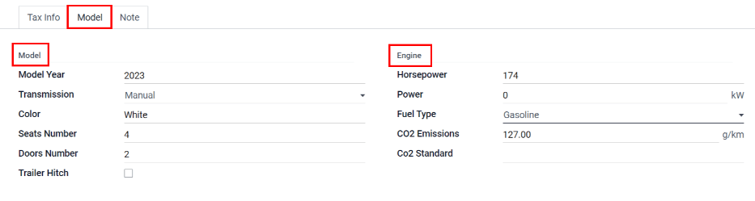

=================
Add a new vehicle
=================

Odoo Fleet manages all vehicles and the accompanying documentation that comes with vehicle
maintenance and driver's records.

All vehicles are organized on the main :guilabel:`Fleet` dashboard. Each vehicle has its own vehicle
form, which is displayed as a card in the kanban view. Every vehicle form is displayed in its
current corresponding kanban status column.

To add a new vehicle to the fleet, click the :guilabel:`Create` button, and a blank vehicle form
will load. Enter the vehicle information in the vehicle form, then click :guilabel:`Save`.

Vehicle form fields
===================

- :guilabel:`Model`: Select the vehicle's model from the drop-down menu. If the model is not listed,
  type in the model name and click either :guilabel:`Create` or :guilabel:`Create and Edit`. This is
  the only required field on the vehicle form.
- :guilabel:`License Plate`: Enter the vehicle's license plate number in this field.
- :guilabel:`Tags`: Select any tags from the drop-down menu, or type in a new tag. There is no limit
  on the amount of tags that can be selected.

.. note::
   The :guilabel:`Model` is the only required fied on the new vehicle form. When a model is
   selected, other fields will appear on the vehicle form. If some of the fields do not appear, this
   may indicate there is no model selected.

Driver
------

- :guilabel:`Driver`: Select the driver from the drop-down menu, or type in a new driver and click
  either :guilabel:`Create` or :guilabel:`Create and Edit`.
- :guilabel:`Future Driver`: If the next driver is known, select the future driver from the
  drop-down menu, or type in the new driver and click either :guilabel:`Create` or :guilabel:`Create
  and Edit`.
- :guilabel:`Plan To Change Car`: If both the next driver is known, and when the change will
  happen, check this box.
- :guilabel:`Assignment Date`: Select the date the next driver will be assigned to the vehicle using
  the drop-down calendar module.

Vehicle
-------

- :guilabel:`Immatriculation Date`: Select the date the vehicle is acquired using the drop-down
  calendar module.
- :guilabel:`Cancellation Date`: Select the date the vehicle lease will expire, or when the vehicle
  will be no longer available, using the drop-down calendar module.
- :guilabel:`Chasis Number`: Enter the :guilabel:`Chasis Number` in the field. This is known in
  some countries as the :abbr:`VIN (Vehicle Identification Number)` number.
- :guilabel:`Last Odometer`: Enter the last known odometer reading in the number field. Using the
  drop-down menu next to the number field, select whether the odometer reading is in kilometers 
  :guilabel:`(km)` or miles :guilabel:`(mi)`.
- :guilabel:`Fleet Manager`: Select the fleet manager from the drop-down menu, or type in a new
  fleet manager and click either :guilabel:`Create` or :guilabel:`Create and Edit`.
- :guilabel:`Location`: Type in the locatin where the vehicle will be stored in the field.
- :guilabel:`Company`: Select the company that the vehicle will be used for and associated with from
  the drop-down menu, or type in a new company and click either :guilabel:`Create` or
  :guilabel:`Create and Edit`.

.. image:: new_vehicle/new-vehicle-type.png
   :align: center
   :alt: The new vehicle form, showing the vehicle tax section.

Tax Info tab
------------

Fiscality
~~~~~~~~~

- :guilabel:`Horsepower Taxation`: The amount that can be taxed based on the size of the vehicles
  engine.
- :guilabel:`Disallowed Expense Rate`: 
- :guilabel:`Start Date`:  

Contract
~~~~~~~~

- :guilabel:`First Contract Date`: Select the start date for the vehicle's first contract using
  the drop-down calendar module. Typically this is the day the vehicle is purchased or leased.
- :guilabel:`Catalog Value (VAT Incl.)`: Enter the MSRP (Manufacturer's Suggested Retail Price) for
  the vehicle at the time of purchase or lease.
- :guilabel:`Purchase Value`: Enter the purchase price or the value of the lease for the vehicle.
- :guilabel:`Residual Value`: Enter the current value of the vehicle.

.. image:: new_vehicle/new-vehicle-tax.png
   :align: center
   :alt: The new vehicle form, showing the vehicle tax section.

Model tab
---------

Model
~~~~~

- :guilabel:`Model Year`: Enter the year the vehicle was manufactured.
- :guilabel:`Transmission`: Select the transmission type from the drop-down menu, either
  :guilabel:`Manual` or :guilabel:`Automatic`.
- :guilabel:`Color`: Enter the color of the vehicle.
- :guilabel:`Seats Number`: Enter how many seats the vehicle has.
- :guilabel:`Doors Number`: Enter the number of doors the vehicle has.
- :guilabel:`Trailer Hitch`: Check the box if the vehicle has a trailer hitch.

Engine
~~~~~~

- :guilabel:`Horsepower`: Enter the vehicle's horsepower in this field.
- :guilabel:`Power`: If the vehicle is electric or hybrid, enter the power the vehicle uses in
  kilowatts.
- :guilabel:`Fuel Type`: Select the type of fuel the vehicle uses form the drop-down menu. The
  options are :guilabel:`Diesel`, :guilabel:`Gasoline`, :guilabel:`Hybrid Diesel`, :guilabel:`Hybrid
  Gasoline`, :guilabel:`Plug-in Hybrid Diesel`, :guilabel:`Plug-in Hybrid Gasoline`,
  :guilabel:`CNG`, :guilabel:`LPG`, :guilabel:`Hydrogen`, or :guilabel:`Electric`.
- :guilabel:`CO2 Emissions`: Enter the emissions the vehicle produces in grams per kilometer
  (g/km).
- :guilabel:`Co2 Standard`: Enter the.

Note tab
--------

Enter any notes for the vehicle in this section.
